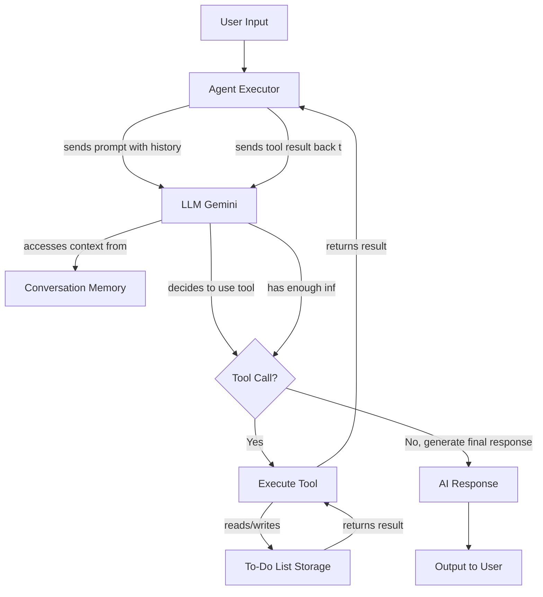

# Agentic AI to-do Assistant

This project is a conversational AI agent designed to act as a personal assistant. It can hold a conversation, remember context across sessions, manage a persistent to-do list using intelligent tools, and is presented through a clean, user-friendly web interface.

## Core Features

*   **Conversational Memory**: Remembers user details (like name) and conversation history across sessions.
*   **Persistent To-Do List**: Stores tasks in a `todos.json` file so the list is never lost.
*   **Web Interface**: A user-friendly chat interface built with Streamlit for a smooth user experience.
*   **Bonus - Intelligent Task Removal**: Features a `smart_remove_todo` tool that can find and delete a task even if the users request is vague (e.g., "Im done with the assignment").
*   **Bonus - Task Counting**: Includes a `count_todos` tool to inform the user how many items are on their list.

## Architecture

The agent is built using LangChains stable `AgentExecutor`. This architecture follows the well-established **ReAct (Reasoning and Acting)** model, where the Language Model (LLM) reasons about a users request and chooses to act by executing a set of predefined tools.

### Flow Description



## How Memory is Stored and Retrieved

Persistence is a key feature handled using simple local files:

*   **Conversation History**: `FileChatMessageHistory` (from `langchain_community`) automatically serializes the conversation to a `chat_history.json` file. When the agent restarts, this history is loaded into the `ConversationBufferMemory`, giving the agent its long-term memory.

*   **To-Do List**: The to-do list is stored in `todos.json`. The tool functions in `tools.py` are solely responsible for all file interactions, following a clear **read-modify-write** pattern to ensure data integrity.

## How Tool Calls are Defined and Registered

*   **Definition**: Each tool is a Python function in `tools.py` decorated with LangChains **`@tool`** decorator. The functions docstring serves as the description that the LLM uses to decide when to call the tool.
*   **Registration**: The tool functions are collected into a `tools` list. In `main.py` (for the CLI) and `app.py` (for the UI), this list is passed directly to the `initialize_agent` function, making the agent aware of the actions it can perform.

## Setup and Run Instructions

This project includes both a modern web interface (recommended) and a traditional command-line interface.

1.  **Clone the Repository** and navigate into the directory.
2.  **(Windows Only) Install C++ Build Tools**: To prevent build errors with dependencies like `numpy`, it is highly recommended to install the **"Build Tools for Visual Studio"** from Microsofts website, selecting the "Desktop development with C++" workload. A system restart is required after installation.
3.  **Create and Activate Virtual Environment**:
    ```bash
    python -m venv venv
    # On Windows (PowerShell or VS Code Terminal)
    .\venv\Scripts\Activate.ps1
    ```
4.  **Install Dependencies**:
    ```bash
    pip install -r requirements.txt
    ```
5.  **Set Up API Key**:
    *   Create a `.env` file and add your Google API Key: `GOOGLE_API_KEY="YOUR_API_KEY_HERE"`
6.  **Run the Application**:

    ### Running the Web App (Recommended)
    
    In your terminal, run the following command:
    ```bash
    streamlit run app.py
    ```
    Your web browser will automatically open with the chat interface.

    ### Running the Command-Line Interface (CLI)
    
    If you prefer a traditional CLI, you can run the original entry point:
    ```bash
    python main.py
    ```

## Architectural Considerations & Future Improvements

### Deprecation Warnings
When running the application, you may see `LangChainDeprecationWarning` messages related to `AgentExecutor`. This is expected. The LangChain ecosystem is evolving rapidly towards its LangGraph library. While a full LangGraph refactor was explored during development, it introduced significant dependency instability. Therefore, the stable and robust `AgentExecutor` was chosen to ensure a complete and functional project that meets all assignment requirements. This was a deliberate engineering trade-off between using bleeding-edge architecture and delivering a reliable product.

### Future Improvements

*   **Priority System**: A great next step would be to add a priority system (e.g., high, normal, low) to tasks. This would involve upgrading the `todos.json` data model to a list of objects and enhancing the `add_todo` tool to parse priorities from the users request, making the agent even more useful.
*   **Multi-User Support**: The current file-based storage is inherently single-user. To support multiple users, the architecture could be upgraded to use a database like SQLite. All data (conversation history, to-do lists) would be keyed by a unique `user_id`.
*   **Streaming Responses**: In the Streamlit UI, agent responses currently appear all at once. The UX could be improved by "streaming" the response token-by-token, making the agent feel more responsive.
