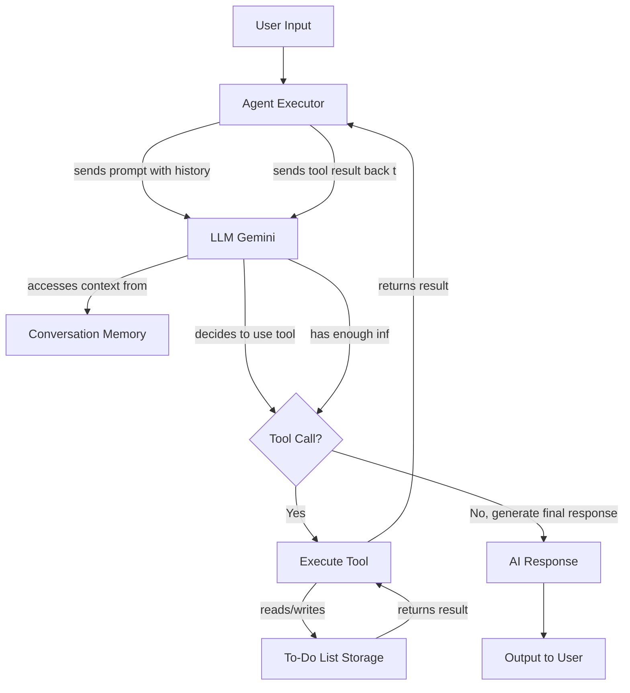

# Snello Agentic Chatbot

This project is a conversational AI agent designed to act as a personal assistant, built to fulfill the "Welcome Builder!" assignment. It can hold a conversation, remember context across sessions, and manage a persistent to-do list using tools.

## Architecture

The agent is built using the standard LangChain `AgentExecutor`. This architecture follows the well-established **ReAct (Reasoning and Acting)** model, where the Language Model (LLM) can reason about a users request and choose to act by executing a set of predefined tools.

The key components are:

1.  **LLM (Language Model)**: **Google Gemini 2.5 Pro** is used as the "brain" of the agent to drive conversation and make decisions.
2.  **Tools**: Python functions (`add_todo`, `list_todos`, `remove_todo`) that the agent can execute to interact with the to-do list stored on the file system.
3.  **Memory**: `ConversationBufferMemory` is used to store the history of the conversation. This memory is explicitly configured with `FileChatMessageHistory` to ensure it is persistent between sessions.
4.  **Agent Executor**: The main engine from LangChain (`initialize_agent`) that orchestrates the interaction between the LLM, Memory, and Tools, creating the agents response loop.

### Flow Description



## How Memory is Stored and Retrieved

Persistence is a key feature and is handled using simple local files:

*   **Conversation History**: `FileChatMessageHistory` (from `langchain_community`) automatically serializes the conversation to a file named `chat_history.json`. When the agent restarts, this history is loaded into the `ConversationBufferMemory`, giving the agent its long-term memory.

*   **To-Do List**: The to-do list is stored in `todos.json`. The tool functions in `tools.py` are responsible for all file interactions, following a clear **read-modify-write** pattern to ensure data integrity.

## How Tool Calls are Defined and Registered

*   **Definition**: Each tool is a Python function in `tools.py` decorated with LangChains **`@tool`** decorator. The functions docstring serves as the description that the LLM uses to decide when to call the tool.
*   **Registration**: In `main.py`, the tool functions are collected into a `tools` list. This list is passed directly to the `initialize_agent` function, making the agent aware of the actions it can perform.

## Setup and Run Instructions

1.  **Clone the Repository** and navigate into the directory.
2.  **(Windows Only) Install C++ Build Tools**: To prevent build errors with dependencies like `numpy`, install the **"Build Tools for Visual Studio"** from Microsofts website, selecting the "Desktop development with C++" workload. A system restart is required.
3.  **Create and Activate Virtual Environment**:
    ```bash
    python -m venv venv
    # On Windows
    .\venv\Scripts\Activate.ps1
    ```
4.  **Install Dependencies**:
    ```bash
    pip install -r requirements.txt
    ```
5.  **Set Up API Key**:
    *   Create a `.env` file and add your Google API Key: `GOOGLE_API_KEY="YOUR_API_KEY_HERE"`
6.  **Run the Chatbot**:
    ```bash
    python main.py
    ```

## Architectural Considerations & Future Work

*   **AgentExecutor vs. LangGraph**: This project uses the stable `AgentExecutor`. While a `DeprecationWarning` may appear during use, this approach is robust and fully functional. An alternative architecture using **LangGraph** was explored during development. LangGraph offers more explicit, granular control over the agents state machine but introduces significant complexity, especially regarding dependency management with its rapidly evolving API. For this assignment, the `AgentExecutor` was chosen as the most reliable and direct implementation of the ReAct framework that meets all project requirements.
*   **Multi-User Support**: The current file-based storage is single-user. A future improvement would be to use a database like SQLite to manage multiple users and their to-do lists separately, keyed by a unique `user_id`.
